---
## 🌟 About Me

Hey there! I'm **Thiago**, a passionate **Full-Stack Software Developer** and **Technical Lead** driven by curiosity and the constant pursuit of improvement. I love designing and building systems that are not only functional but elegant, scalable, and efficient.  

With solid experience in **backend development using Go, Java, TypeScript and Spring Boot**, I specialize in building **microservices**, **RESTful APIs**, and **event-driven architectures** that power reliable cloud-based applications.  

On the frontend side, I enjoy crafting dynamic and intuitive interfaces with **Angular**, always aiming to deliver smooth and engaging user experiences.  

I'm also deeply interested in **AI and Computer Vision**, exploring how technology can perceive and interpret the world visually — from real-time image processing to intelligent automation.  

Throughout my journey, I’ve worked on projects that span from **API integrations and data analytics** to **containerized deployments with Docker and Kubernetes**, leveraging **AWS and GCP** for cloud-native scalability.  

Beyond coding, I value **team collaboration, mentoring**, e **promoting clean code principles**, garantindo que o software cresça de forma sustentável ao longo do tempo.  

> “Great code isn’t just written — it’s designed with purpose and empathy for those who will build upon it.”

---

## 🛠️ Tech Arsenal

### 💻 Programming Languages

### 🎨 Frontend Technologies

### ⚙️ Backend Technologies

### 🗄️ Databases & Cloud

### 🔬 Data Science & AI

### 🔧 Tools & Platforms

---

## 📊 GitHub Analytics

  
  

  

---

  
<h3>🯠Visualise Current Goals Diagram</h3>

  
 

```mermaid
graph LR
    A[🎯 Current Goals] --> B[🏗️ Microservices Architecture]
    A --> C[🤖 AI and Computer Vision]
    A --> D[☁️ Cloud Native Solutions]
    A --> E[👥 Technical Leadership]
    A --> J[⚙️ Fullstack Development]

    %% Microservices Branch
    B --> F[Event-Driven Systems]
    B --> K[Go and Java Backends]
    B --> L[Scalable APIs]

    %% AI / Vision Branch
    C --> G[Deep Learning Models]
    C --> M[Object Detection and Tracking]
    C --> N[Real-time Image Processing]

    %% Cloud Branch
    D --> H[Kubernetes and Docker]
    D --> O[Multi-cloud AWS GCP Azure]
    D --> P[CI/CD Pipelines]

    %% Leadership Branch
    E --> I[Agile and Mentoring]
    E --> Q[Code Quality and Reviews]

    %% Fullstack Branch
    J --> R[Angular Frontends]
    J --> S[REST and GraphQL Integration]

```

### 📫 Let's Connect!

**I'm always open to discussing new opportunities, innovative projects, or just having a tech chat over coffee!**

📧 **Email:** your.email@example.com  
💼 **LinkedIn:** [Thiago de Oliveira](https://www.linkedin.com/in/thiago-de-oliveira-sampaio-0085a8239/)  
📸 **Instagram:** [@thiao_samp](https://instagram.com/thiao_samp)  
🐦 **Twitter:** [@skadush5232](https://twitter.com/skadush5232)

---

> *"Do, or do not. There is no 'try'."* — Yoda

⭐ **If you find my work interesting, don't forget to star my repositories!**

